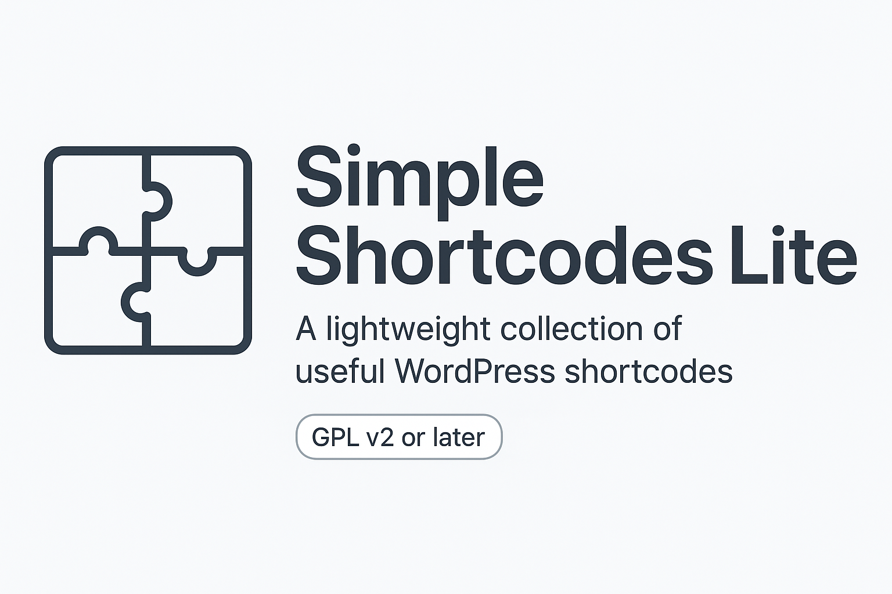

# 🧩 Simple Shortcodes Lite

A lightweight collection of versatile WordPress shortcodes — built for fast implementation, clean output, and developer flexibility.




---

## ✨ Features

- ✅ Clean procedural PHP
- ✅ No third-party dependencies
- ✅ Designed for content creators, freelancers, and theme developers
- ✅ Easy to extend with your own shortcodes

---

## 🔧 Included Shortcodes

| Shortcode | Purpose | Example |
|----------|---------|---------|
| `[current_year]` | Outputs current year | `© [current_year]` → `© 2025` |
| `[br count="2"]` | Inserts line breaks | `[br count="3"]` |
| `[button url="" text="" target=""]` | Styled button link | `[button url="https://..." text="Click Me"]` |
| `[highlight text="" color=""]` | Highlights text | `[highlight text="Note" color="yellow"]` |
| `[divider type="dashed"]` | Horizontal rule | `[divider type="dotted"]` |
| `[icon name="" color="" size=""]` | Outputs icon | `[icon name="check" color="#4CAF50"]` |
| `[youtube id=""]` | Embed YouTube video | `[youtube id="dQw4w9WgXcQ"]` |
| `[note type="info"]...[/note]` | Styled info box | `[note type="warning"]Be careful[/note]` |
| `[grid] [col]...[/col] [/grid]` | Grid layout | 2-3 column content blocks |

---

## 🚀 Installation

1. Download the plugin ZIP from [Releases](https://github.com/physicsisrelativelycool/simple-shortcodes-lite/releases)
2. Upload it to your WordPress site via **Plugins > Add New > Upload Plugin**
3. Activate the plugin
4. Use shortcodes in any post, page, or widget area

---

## 📂 Folder Structure

```
simple-shortcodes-lite/
├── includes/
│   ├── shortcodes-core.php
│   └── shortcodes-grid.php
├── assets/
│   └── css/
│       └── shortcodes.css
├── dm-shortcodes-lite.php
└── LICENSE
```

---

## 🛠️ Developer Notes

- Written in procedural PHP
- Sanitized via `esc_html()`, `esc_url()`, `shortcode_atts()`
- Minimal styling included (`assets/css/shortcodes.css`)
- No reliance on jQuery or other libraries

---

## 🪪 License

This plugin is licensed under the **GNU General Public License v2.0 or later**.  
You are free to use, modify, and redistribute it — just retain credit and GPL compatibility.

---

## 🧠 Author

**Brett Cuthbertson**  
[GitHub: @physicsisrelativelycool](https://github.com/physicsisrelativelycool)

---

## 🙌 Contributions

If you have ideas for additional shortcodes or optimizations, feel free to open an issue or fork the repo!
